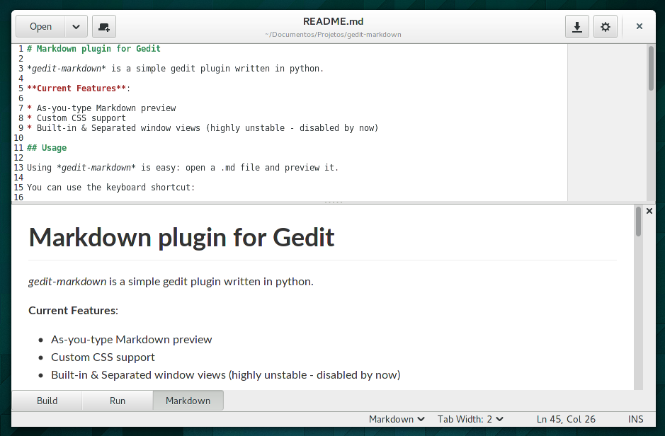

# Markdown plugin for Gedit

*gedit-markdown* is a simple gedit plugin written in python.

**Current Features**:

* As-you-type Markdown preview
* Custom CSS support
* Built-in & Separated window views (highly unstable - disabled by now)

## Usage

Using *gedit-markdown* is easy: open a .md file and preview it.

You can use the keyboard shortcut:

    <Primary><Shift> M

## Installation

To install it, simply run as user:

    $ make && make install

After that, it'll be installed in .local/share/gedit/plugins.

## System Requirements

* Gedit >= 3.11.8
* python-markdown

## Development

You can check on the current development status of the plugin at:

    https://github.com/GeorgesStavracas/gedit-markdown

Comments, ideas and (most of all) bug reports (and especially patches) are very welcome.

## Current status

- [x] Preview Markdown files
- [x] As-you-type preview
- [x] Support custom CSS
- [ ] Markdown extensions
- [ ] Export as HTML

##TODO
* Remove python-markdown dependency (self containable)
* Support Markdown extensions
* Test it to the death	
